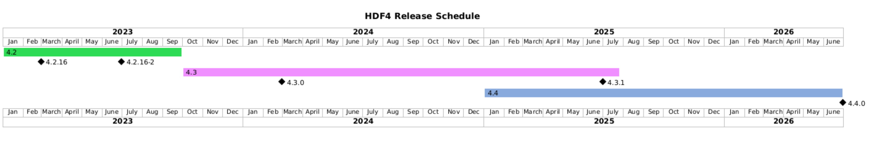

HDF version 4.3.1-1 currently under development

DOCUMENTATION
-------------
Full Documentation and Programming Resources for this release can be found at

   https://portal.hdfgroup.org/hdf4/

See the RELEASE.txt file in the release\_notes/ directory for information specific
to the features and updates included in this release of the library.

Several more files are located within the release\_notes/ directory with specific
details for several common platforms and configurations.

    INSTALL - Start Here. General instructions for compiling and installing the library
    INSTALL_CMAKE  - instructions for building with CMake (Kitware.com)
    INSTALL_WINDOWS and INSTALL_CYGWIN - MS Windows installations.

FORUM and NEWS
--------------
The following public forums are provided for public announcements and discussions
of interest to the general HDF4 Community.

   - Homepage of the Forum
   https://forum.hdfgroup.org

   - News and Announcement
   https://forum.hdfgroup.org/c/news-and-announcements-from-the-hdf-group

   - HDF4 Topics
   https://forum.hdfgroup.org/c/hdf4

These forums are provided as an open and public service for searching and reading.
Posting requires completing a simple registration and allows one to join in the
conversation.  Please read the following instructions pertaining to the Forum's
use and configuration
    https://forum.hdfgroup.org/t/quickstart-guide-welcome-to-the-new-hdf-forum

RELEASE SCHEDULE
----------------

 

HDF4 does not release on a regular schedule. Instead, releases are driven by
new features and bug fixes, though we try to have at least one release of each
maintenance branch per year. Future HDF4 releases indicated on this schedule
are tentative.

| Release | New Features |
| ------- | ------------ |
| 4.4.0 | Drop FORTRAN 77 support, Drop netCDF 2.3.2 API + tools, Unified library (maybe) |

HDF 4.4.0 (February 2025)
* We will drop support for FORTRAN 77 and move to modern Fortran (2003 or 2008)
* HDF4 includes an ancient netCDF 2.3.2 API along with HDF4-built ncdump and ncgen tools. Support for these will be dropped in 4.4.0. netCDF APIs and tools should be obtained from Unidata.
* (maybe) libdf and libmfhdf will be merged into a single libhdf4 library, Fortran will be built as a separate library

The goal of the HDF 4.4.0 release is to address long-standing deficiencies
and bring HDF4 in line with HDF5's build practices. This should allow HDF4
to work better with modern systems and compilers and be more easily
maintained.

The 4.3 maintenance line will be retired when 4.4.0 releases. There are no
more planned HDF 4.3.x releases.

SNAPSHOTS, PREVIOUS RELEASES AND SOURCE CODE
--------------------------------------------
Periodically development code snapshots are provided at the following URL:
    
   https://github.com/HDFGroup/hdf4/releases/tag/snapshot

Source packages for current and previous releases are located at:

   https://portal.hdfgroup.org/downloads/

Development code is available at our Github location:
    
   https://github.com/HDFGroup/hdf4.git

Source Distribution Layout
--------------------------

 The top level of the source code distribution contains the following
 subdirectories:

   bin    -- Scripts for maintenance.

   config -- Configuration files to be used by configure script.

   doc    -- HDF 4.2 to 4.3 Migration Guide

   hdf    -- The source code for the HDF 'base library', the multi-file
             annotation interface, the multi-file raster image interface,
             HDF command line utilities, and a test suite.
             Please see the README in each directory for further
             information on each package.

   java   -- The Java HDF JNI library

   m4     -- Autotools macros and libtool files for building with autotools.

   mfhdf  -- The netCDF(mfhdf) part of the HDF/mfhdf distribution and
             additional HDF utilities, such as hdp, hrepack, hdfimport, etc.

   release\_notes --
             Installation instructions for UNIX and Windows.
             Descriptions of new features and bug fixes in this release.
             Files in this sub-directory can be used as supplemental
             documentation for HDF.

Third Party Software Requirements
---------------------------------
  * JPEG distribution release 6b or later.

  * ZLIB 1.1.4(libz.a) or later.

System Requirements
-------------------
 To build the HDF library from source, you need:

   * C and Fortran compilers. For a list of the supported compilers,
     see release_docs/RELEASE.txt file.
